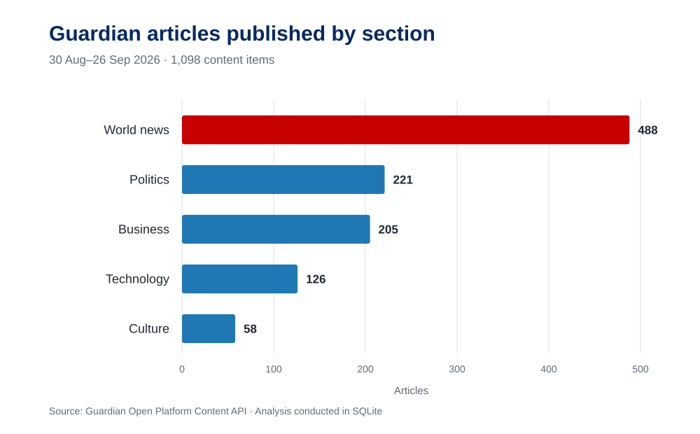
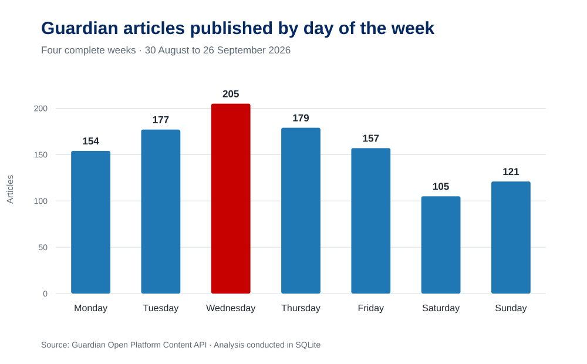
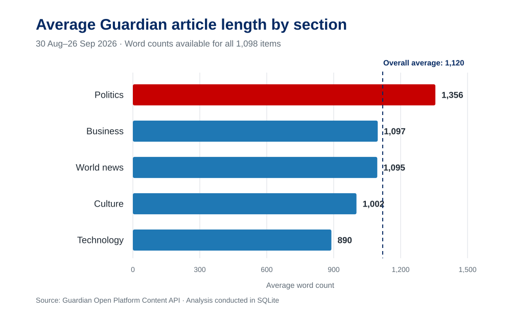

# Guardian Editorial Output Analysis

A beginner-friendly SQL portfolio project analysing Guardian publication metadata. The project examines editorial output by section, publication date, time, contributor, article length and tags. It does not claim to measure reader engagement because the public Content API does not provide page-view, reading-time or subscription-conversion data.

## Dataset

- Period: 30 August 2026 to 26 September 2026
- Sections: Business, Technology, World, Politics and Culture
- Source: Guardian Open Platform Content API
- Content collected: metadata only; article body text is not requested

## Create the database

1. Register for a non-commercial Developer key at <https://open-platform.theguardian.com/access/>.
2. In Finder, open this project folder:

   `/Users/agvan/.codex/.chatgpt-projects/g-p-691ca0b6aafc8191b2970dc52cbc6877/guardian-editorial-analysis`

3. Double-click `run_download.command`. If macOS blocks it, right-click it and choose **Open**.
4. Paste the API key when asked and press Enter. The key is deliberately hidden while it is pasted and is not stored.
5. Wait for the download to finish. The script respects the developer rate limit by pausing between API requests.

The script creates:

- `data/guardian_editorial_analysis.sqlite`
- `data/articles.csv`
- `data/tags.csv`
- `data/article_tags.csv`

## Open the database

1. Open DB Browser for SQLite.
2. Select **Open Database**.
3. Open `data/guardian_editorial_analysis.sqlite`.
4. Use **Database Structure** to inspect the three tables.
5. Use **Browse Data** to inspect rows.
6. Use **Execute SQL** to run the queries in `sql/analysis_queries.sql`.

## Tables

- `articles`: one row per Guardian content item
- `tags`: one row per keyword or contributor tag
- `article_tags`: links articles to their tags

## Research questions

1. How did publishing volume vary by section and day of the week?
2. At what times of day were articles most frequently published?
3. How did average article length differ between sections?
4. Which contributors and keyword tags appeared most frequently?
5. Which sections had above-average article lengths?

## Key findings

- World news had the highest publication volume, with 488 of 1,098 content items.
- Wednesday was the busiest publishing day, with 205 items across the four-week period.
- Politics had the highest average article length at approximately 1,356 words and was the only section above the overall average of approximately 1,120 words.
- Afternoon was the busiest publishing period, accounting for 513 items, or approximately 46.7% of the dataset.
- Contributor tags produced more reliable author-level counts than the free-text `byline` field, which sometimes included job titles and other variations.

## Visualisations

### Publication volume by section



### Publication volume by day of the week



### Average article length by section



The dashed line in the final chart marks the overall average article length across the five selected sections.

## Recreate the charts

After creating the database, run `create_charts.py`. The script reads the results directly from SQLite and recreates the three SVG files in the `charts` folder using only Python's standard library.

## Project structure

```text
guardian-editorial-analysis/
├── charts/                 # Portfolio-ready visualisations
├── data/                   # SQLite database and exported CSV files
├── results/findings.md     # Detailed results and interpretation
├── sql/analysis_queries.sql
├── create_charts.py
├── download_guardian_data.py
└── README.md
```

## Limitations

The dataset measures publishing activity, not article performance. It does not contain page views, unique visitors, reading time, scroll depth, subscriptions or other engagement metrics. Results should therefore be described as patterns in editorial output.
